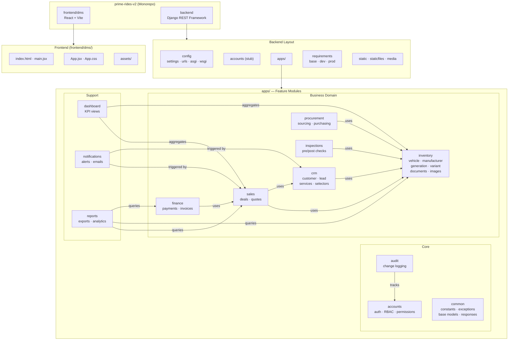

# Prime Rides V2 — Project File Structure Diagram

> Generated: 2026-07-30

---

## Project Tree

```
prime-rides-v2/
├── .env.example
├── .gitignore
│
├── backend/                          ← Django REST Framework project
│   ├── .env
│   ├── manage.py
│   ├── db.sqlite3
│   │
│   ├── config/                       ← Django project settings
│   │   ├── __init__.py
│   │   ├── settings.py
│   │   ├── urls.py
│   │   ├── asgi.py
│   │   └── wsgi.py
│   │
│   ├── accounts/                     ← Top-level accounts stub app
│   │   ├── __init__.py
│   │   ├── admin.py
│   │   ├── apps.py
│   │   ├── models.py
│   │   ├── views.py
│   │   ├── tests.py
│   │   └── migrations/
│   │
│   ├── apps/                         ← Domain feature apps
│   │   ├── __init__.py
│   │   │
│   │   ├── accounts/                 ← User auth & RBAC
│   │   │   ├── __init__.py
│   │   │   ├── admin.py
│   │   │   ├── apps.py
│   │   │   ├── choices.py
│   │   │   ├── managers.py
│   │   │   ├── models.py
│   │   │   ├── permissions.py
│   │   │   ├── rbac.py
│   │   │   ├── serializers.py
│   │   │   ├── services.py
│   │   │   ├── views.py
│   │   │   ├── urls.py
│   │   │   ├── tests.py
│   │   │   ├── management/
│   │   │   └── migrations/
│   │   │
│   │   ├── audit/                    ← Audit logging
│   │   │   ├── __init__.py
│   │   │   ├── admin.py
│   │   │   ├── apps.py
│   │   │   ├── models.py
│   │   │   ├── views.py
│   │   │   ├── tests.py
│   │   │   └── migrations/
│   │   │
│   │   ├── common/                   ← Shared utilities & base models
│   │   │   ├── __init__.py
│   │   │   ├── admin.py
│   │   │   ├── apps.py
│   │   │   ├── constants.py
│   │   │   ├── exception_handler.py
│   │   │   ├── exceptions.py
│   │   │   ├── managers.py
│   │   │   ├── responses.py
│   │   │   ├── views.py
│   │   │   ├── tests.py
│   │   │   ├── models/
│   │   │   └── migrations/
│   │   │
│   │   ├── crm/                      ← Customer Relationship Management
│   │   │   ├── __init__.py
│   │   │   ├── apps.py
│   │   │   ├── filters.py
│   │   │   ├── managers.py
│   │   │   ├── permissions.py
│   │   │   ├── selectors.py
│   │   │   ├── views.py
│   │   │   ├── urls.py
│   │   │   ├── tests.py
│   │   │   ├── models/
│   │   │   │   ├── __init__.py
│   │   │   │   ├── customer.py
│   │   │   │   └── lead.py
│   │   │   ├── serializers/
│   │   │   ├── services/
│   │   │   ├── validators/
│   │   │   └── migrations/
│   │   │
│   │   ├── dashboard/                ← Dashboard summaries
│   │   │   ├── __init__.py
│   │   │   ├── admin.py
│   │   │   ├── apps.py
│   │   │   ├── models.py
│   │   │   ├── views.py
│   │   │   ├── tests.py
│   │   │   └── migrations/
│   │   │
│   │   ├── finance/                  ← Financial transactions
│   │   │   ├── __init__.py
│   │   │   ├── admin.py
│   │   │   ├── apps.py
│   │   │   ├── models.py
│   │   │   ├── views.py
│   │   │   ├── tests.py
│   │   │   └── migrations/
│   │   │
│   │   ├── inspections/              ← Vehicle inspections
│   │   │   ├── __init__.py
│   │   │   ├── admin.py
│   │   │   ├── apps.py
│   │   │   ├── models.py
│   │   │   ├── views.py
│   │   │   ├── tests.py
│   │   │   └── migrations/
│   │   │
│   │   ├── inventory/                ← Vehicle stock management
│   │   │   ├── __init__.py
│   │   │   ├── admin.py
│   │   │   ├── apps.py
│   │   │   ├── filters.py
│   │   │   ├── managers.py
│   │   │   ├── permissions.py
│   │   │   ├── selectors.py
│   │   │   ├── validators.py
│   │   │   ├── views.py
│   │   │   ├── urls.py
│   │   │   ├── tests.py
│   │   │   ├── admin/
│   │   │   ├── models/
│   │   │   │   ├── __init__.py
│   │   │   │   ├── base.py
│   │   │   │   ├── generation.py
│   │   │   │   ├── lookup.py
│   │   │   │   ├── manufacturer.py
│   │   │   │   ├── stock_sequence.py
│   │   │   │   ├── variant.py
│   │   │   │   ├── vehicle.py
│   │   │   │   ├── vehicle_document.py
│   │   │   │   ├── vehicle_image.py
│   │   │   │   └── vehicle_model.py
│   │   │   ├── serializers/
│   │   │   ├── services/
│   │   │   └── migrations/
│   │   │
│   │   ├── notifications/            ← Notification system
│   │   │   ├── __init__.py
│   │   │   ├── admin.py
│   │   │   ├── apps.py
│   │   │   ├── models.py
│   │   │   ├── views.py
│   │   │   ├── tests.py
│   │   │   └── migrations/
│   │   │
│   │   ├── procurement/              ← Vehicle procurement / purchasing
│   │   │   ├── __init__.py
│   │   │   ├── admin.py
│   │   │   ├── apps.py
│   │   │   ├── models.py
│   │   │   ├── views.py
│   │   │   ├── tests.py
│   │   │   └── migrations/
│   │   │
│   │   ├── reports/                  ← Reporting module
│   │   │   ├── __init__.py
│   │   │   ├── admin.py
│   │   │   ├── apps.py
│   │   │   ├── models.py
│   │   │   ├── views.py
│   │   │   ├── tests.py
│   │   │   └── migrations/
│   │   │
│   │   └── sales/                    ← Sales & deals
│   │       ├── __init__.py
│   │       ├── admin.py
│   │       ├── apps.py
│   │       ├── models.py
│   │       ├── views.py
│   │       ├── tests.py
│   │       └── migrations/
│   │
│   ├── requirements/                 ← Python dependencies
│   │   ├── base.txt
│   │   ├── development
│   │   └── production
│   │
│   ├── docs/                         ← Documentation (this file lives here)
│   ├── media/                        ← User-uploaded files
│   ├── static/                       ← Static source files
│   ├── staticfiles/                  ← Collected static (production)
│   ├── scripts/                      ← Utility scripts
│   └── tests/                        ← Global test suite
│
└── frontend/                         ← React (Vite) SPA
    └── dms/
        ├── index.html
        ├── package.json
        ├── vite.config.js
        ├── eslint.config.js
        ├── public/
        └── src/
            ├── main.jsx
            ├── App.jsx
            ├── App.css
            ├── index.css
            └── assets/
```

---

## Architecture Diagram (Mermaid)



---

## App Responsibility Summary

| App | Responsibility | Maturity |
|-----|---------------|---------|
| `apps/accounts` | User model, authentication, RBAC, custom permissions | 🟢 Active |
| `apps/audit` | Audit trail / change logging | 🟡 Stub |
| `apps/common` | Shared base models, constants, exception handling, API responses | 🟢 Active |
| `apps/crm` | Customer profiles, lead management, CRM pipeline | 🟢 Active |
| `apps/dashboard` | Aggregated KPI dashboard views | 🟡 Stub |
| `apps/finance` | Financial records, payments, invoices | 🟡 Stub |
| `apps/inspections` | Pre/post-purchase vehicle inspections | 🟡 Stub |
| `apps/inventory` | Vehicle stock: manufacturers, models, generations, variants, documents, images | 🟢 Active |
| `apps/notifications` | In-app / email / push notifications | 🟡 Stub |
| `apps/procurement` | Vehicle sourcing and purchasing flows | 🟡 Stub |
| `apps/reports` | Business reporting and data exports | 🟡 Stub |
| `apps/sales` | Deals, quotes, and sales transactions | 🟡 Stub |

> 🟢 Active = models + serializers + services + selectors + views + urls implemented
> 🟡 Stub = scaffold only (admin · models · views · tests · migrations placeholder)

---

## Key Design Patterns

| Pattern | Where Used |
|---------|-----------|
| **Service-layer** | Business logic isolated in `services/` sub-packages (`inventory`, `crm`) |
| **Selector pattern** | Read-only query logic in `selectors.py` keeps views thin (`inventory`, `crm`) |
| **Split models package** | Complex domains use `models/` directory (`inventory`, `crm`, `common`) |
| **Split serializers** | Rich domains use a `serializers/` sub-package instead of a single file |
| **RBAC** | Centralised role-based access in `apps/accounts/rbac.py` + `permissions.py` |
| **Shared base** | `apps/common/` provides base model classes, managers, and exception handling reused across apps |
| **Custom managers** | Query logic encapsulated in `managers.py` per app |
| **Custom filters** | DRF filter classes in `filters.py` (`inventory`, `crm`) |
